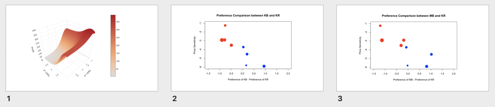
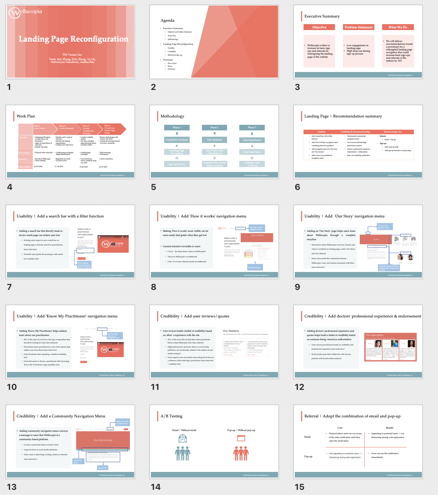
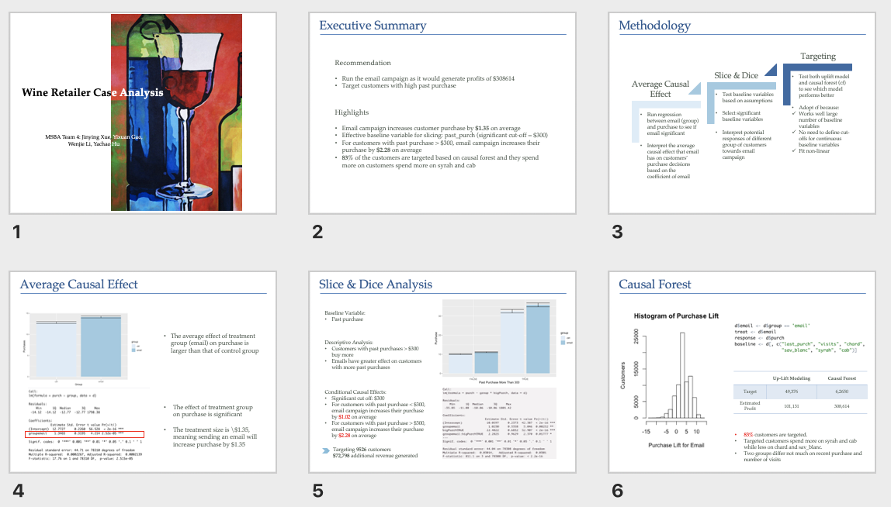

## Project Portfolio

---

### Projects with R 

[Pricing Analytics: Launching New Product](pdf/Pricing-Project2.html)
> ##Abstract
This project aims to illustrate how businesses can utilize choice data and demographic information to understand customer preferences and maximize its profit by studying segmentation and product substitution that is relevant to competitive pricing policies or product line pricing. This project includes 3 parts: 1) logit model without segmentation, 2) logit model with segmentation, 3) understanding strategic responses when rival lowers its price.

---
[Product Management: Landing Page Reconfiguration](pdf/Wellacopia Product Management.pdf)

---
[Conjoint Analysis: Toy Horse Product Line Design](pdf/Conjoint Analysis-Toy Horse Product Line Design.html)

---
[Conditional Causal Effect: Email Campaign Targeting](pdf/wineRetailer.html)

